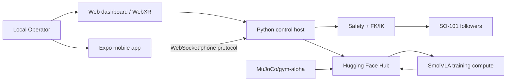

# Container Architecture

Control host is the USB serial owner. `web/checkIk` contains the current teleop/control path; .NET backend, AI integration and Pi agent are not the hardware-control source of truth in the inspected baseline.

