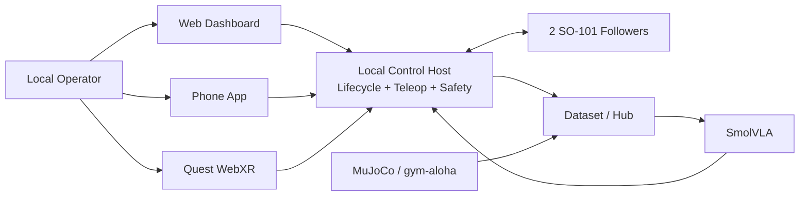

# System Context — VISTA

> Draft đã phản ánh góp ý GVHD; sẽ là phần mở đầu của SRS và tài liệu kiến trúc.

## Bài toán

Nhóm cần dạy hai cánh tay robot SO-101 thực hiện thao tác tabletop từ chỉ dẫn ngôn ngữ, nhưng dữ liệu demonstration bimanual khó thu, robot cần được vận hành an toàn và kết quả fine-tuning phải kiểm chứng được. Nếu chỉ điều khiển robot thủ công, nhóm không có pipeline nhất quán để ghi dữ liệu, train SmolVLA, chạy inference và đối chiếu kết quả trên cùng một task.

VISTA giải quyết bài toán đó bằng một pipeline local-first cho nhiệm vụ **pick một cube hoặc bút rồi đặt hoàn toàn vào hộp nhựa**: người vận hành teleoperate robot để thu data; data được lưu/phiên bản hóa; SmolVLA được fine-tune; checkpoint được chạy và đánh giá trong simulation hoặc hardware thật sau preflight safety. Ứng dụng thực tiễn chính được nhóm chọn là hỗ trợ người vận hành sắp xếp vật dụng nhẹ trên bàn vào hộp/vùng đích.

## Ứng dụng giải quyết gì?

| Vấn đề | Cách VISTA giải quyết |
| --- | --- |
| Khó điều khiển đồng bộ hai arm và dễ gây chuyển động không an toàn | Web, phone và VR teleop đi qua clutch, kinematics, workspace/joint/rate limit, timeout và E-stop. |
| Không có dữ liệu có cấu trúc để train robot | Data collection ghi episode real với camera wrist/top-head, instruction, action và PASS/FAIL; version trên Hugging Face Hub. |
| Không thể thử policy trực tiếp trên robot một cách an toàn | MuJoCo/gym-aloha dùng cùng task benchmark để prototype/pre-deployment evaluation. |
| Không biết SmolVLA có chạy được cho task đã chọn không | Pipeline fine-tune/evaluate dùng split 105/15/30 và report success rate/failure analysis. |
| Khó biết robot, training hoặc safety đang ở trạng thái nào | Dashboard local-first hiển thị readiness, teleop/safety status, camera/arm state, training progress và outcome. |

## Ứng dụng thực tiễn định hướng

VISTA không chỉ là công cụ kỹ thuật để train model. Năng lực cốt lõi là nhận biết một vật trên mặt bàn, hiểu một instruction đơn giản và phối hợp hai arm để pick/place an toàn. Năng lực này có thể áp dụng cho các bối cảnh sau sau khi được mở rộng và đánh giá riêng:

| Bối cảnh thực tiễn | Ví dụ sử dụng | Liên hệ với VISTA | Trạng thái |
| --- | --- | --- | --- |
| Đóng gói và phân loại vật nhỏ | Gắp bút, linh kiện hoặc sản phẩm nhỏ vào hộp/khay đúng vị trí. | Task benchmark cube/bút → hộp là proof-of-concept trực tiếp. | **IN_SCOPE proof-of-concept** |
| Hỗ trợ thao tác phòng thí nghiệm | Di chuyển mẫu/dụng cụ an toàn giữa vị trí đã xác định. | Cần object, gripper, perception và safety validation riêng. | **FUTURE** |
| Giáo dục robotics và AI | Sinh viên dùng teleop để thu data, quan sát model và so sánh real/simulation. | LeRobot, SO-101, dataset và dashboard tạo môi trường học tập tái lập. | **IN_SCOPE secondary use** |
| Hỗ trợ sắp xếp trên bàn | Đưa vật dụng nhẹ như bút/cube vào hộp hoặc vùng đích. | Task benchmark là proof-of-concept cho primitive pick-and-place này. | **IN_SCOPE primary application** |
| Kho dữ liệu thao tác hai tay chi phí thấp | Cung cấp demonstration/evidence để nghiên cứu bimanual manipulation. | Dataset real, simulation và metadata là nền tảng dữ liệu. | **IN_SCOPE research use** |

**Giới hạn trung thực:** Capstone chỉ nghiệm thu task cube/bút vào hộp. Các ứng dụng phòng thí nghiệm, sản xuất hay hỗ trợ đời sống là hướng ứng dụng/roadmap; không được tuyên bố VISTA đã sẵn sàng vận hành trong các môi trường đó nếu chưa có benchmark và evidence tương ứng.

## Thành phần sản phẩm

| Thành phần | Dạng sản phẩm | Trách nhiệm |
| --- | --- | --- |
| Local control host | Laptop kết nối USB tới robot | Find Port, assign, calibrate, preflight, lifecycle, safety và serial boundary. |
| Web dashboard | Website chạy local/trusted LAN | Hiển thị readiness, trạng thái robot/safety, camera, training progress và outcome; Start/Stop/E-stop/Unlock theo workflow. |
| Mobile app | Expo/React Native app | Phone teleop qua WebSocket; iOS development build dùng ARKit 6DoF. Các màn mock không được coi là robot control thật. |
| VR/WebXR surface | Website chạy trên Quest Browser | VR teleop, controller/hand pose, clutch và telemetry/digital twin khi runtime hỗ trợ. |
| Teleoperation gateway | Python control plane | Chuẩn hóa input web/phone/VR, map sang target và tách input khỏi servo. |
| Safety + kinematics | Module control | Validate packet, IK/FK, kiểm workspace/joint/rate, Hold khi timeout và E-stop lock. |
| Dataset pipeline | Data product | Ghi real/sim episode, metadata, split và provenance; lưu Hub. |
| Simulation environment | MuJoCo/gym-aloha | Mô phỏng cùng task benchmark và sim-data có provenance. |
| SmolVLA pipeline | AI product | Fine-tune, checkpoint, inference và evaluation cho đúng task scope. |

## Ranh giới vận hành

## Điều không phải sản phẩm hiện tại

- Không phải dịch vụ điều khiển robot qua Internet/cloud.
- Không có login/RBAC/personal workspace trong phạm vi Capstone.
- Không benchmark ACT hoặc Diffusion Policy.
- Không tuyên bố robot tổng quát ngoài task cube/bút vào hộp.
- Simulation/sim-data dùng để prototype và bổ trợ pipeline; không cam kết chứng minh sim-to-real transfer thành công.
