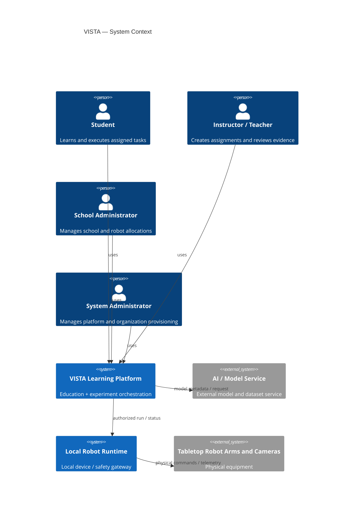

# C4 Level 1 — System Context

Source: draw.io page 01 (Report 4, Figure 01). Conceptual view; verify against source code.

```mermaid
C4Context
  title VISTA — System Context
  Person(student, "Student", "Learns and executes assigned tasks")
  Person(teacher, "Instructor / Teacher", "Creates assignments and reviews evidence")
  Person(schoolAdmin, "School Administrator", "Manages school and robot allocations")
  Person(sysAdmin, "System Administrator", "Manages platform and organization provisioning")
  System(vista, "VISTA Learning Platform", "Education + experiment orchestration")
  System_Ext(ai, "AI / Model Service", "External model and dataset service")
  System(runtime, "Local Robot Runtime", "Local device / safety gateway")
  System_Ext(robot, "Tabletop Robot Arms and Cameras", "Physical equipment")
  Rel(student, vista, "uses")
  Rel(teacher, vista, "uses")
  Rel(schoolAdmin, vista, "uses")
  Rel(sysAdmin, vista, "uses")
  Rel(vista, ai, "model metadata / request")
  Rel(vista, runtime, "authorized run / status")
  Rel(runtime, robot, "physical commands / telemetry")
```
