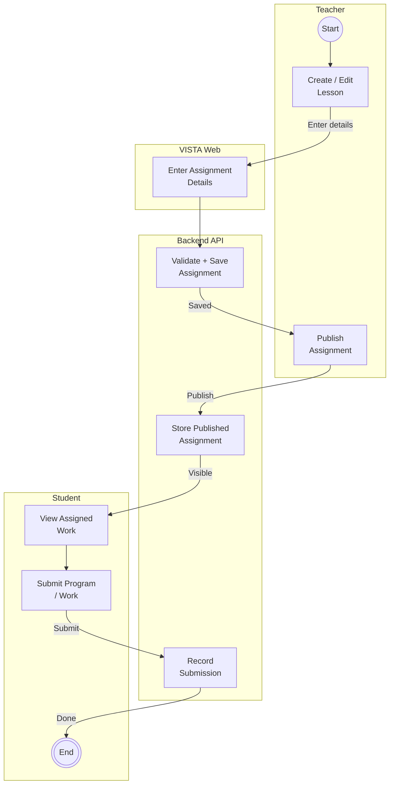

# Activity Diagram — WF-02 — Learning & Assignment Management

Source: draw.io page 05 (Report 4, Figure 05). Swimlanes are Mermaid subgraphs, one per actor / system.

```mermaid
flowchart TB
  subgraph lane0["Teacher"]
    n43(("Start"))
    n44["Create / Edit<br/>Lesson"]
    n47["Publish<br/>Assignment"]
  end
  subgraph lane1["VISTA Web"]
    n45["Enter Assignment<br/>Details"]
  end
  subgraph lane2["Backend API"]
    n46["Validate + Save<br/>Assignment"]
    n48["Store Published<br/>Assignment"]
    n51["Record<br/>Submission"]
  end
  subgraph lane3["Student"]
    n49["View Assigned<br/>Work"]
    n50["Submit Program<br/>/ Work"]
    n52((("End")))
  end
  n43 --> n44
  n44 -->|"Enter details"| n45
  n45 --> n46
  n46 -->|"Saved"| n47
  n47 -->|"Publish"| n48
  n48 -->|"Visible"| n49
  n49 --> n50
  n50 -->|"Submit"| n51
  n51 -->|"Done"| n52
```
