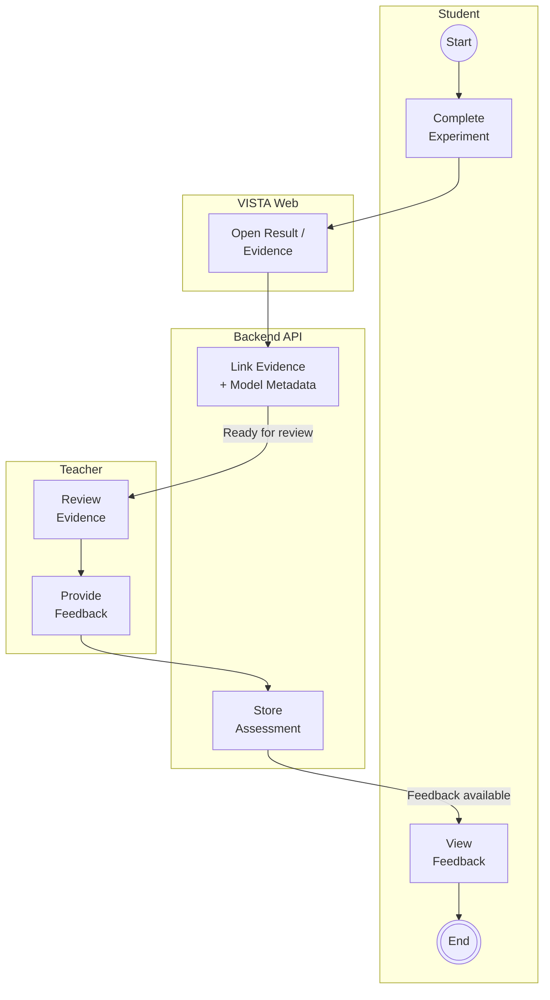

# Activity Diagram — WF-04 — AI/Data Integration & Teacher Review

Source: draw.io page 07 (Report 4, Figure 07). Swimlanes are Mermaid subgraphs, one per actor / system.

```mermaid
flowchart TB
  subgraph lane0["Student"]
    n104(("Start"))
    n105["Complete<br/>Experiment"]
    n111["View<br/>Feedback"]
    n112((("End")))
  end
  subgraph lane1["VISTA Web"]
    n106["Open Result /<br/>Evidence"]
  end
  subgraph lane2["Backend API"]
    n107["Link Evidence<br/>+ Model Metadata"]
    n110["Store<br/>Assessment"]
  end
  subgraph lane3["Teacher"]
    n108["Review<br/>Evidence"]
    n109["Provide<br/>Feedback"]
  end
  n104 --> n105
  n105 --> n106
  n106 --> n107
  n107 -->|"Ready for review"| n108
  n108 --> n109
  n109 --> n110
  n110 -->|"Feedback available"| n111
  n111 --> n112
```
