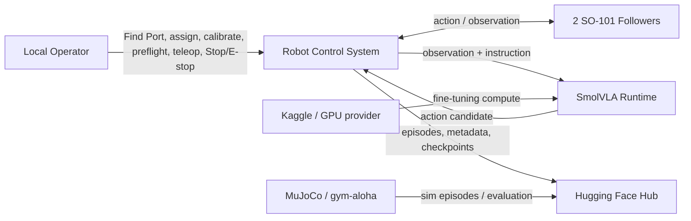

# B4 — Stakeholders và Actors

> Trạng thái: draft chờ duyệt B4–B9. Không suy ra authentication/RBAC từ actor map.

## Stakeholders

| Stakeholder | Mối quan tâm | Trạng thái |
| --- | --- | --- |
| Nhóm Capstone | Hoàn thành pipeline teleop → dataset → simulation → SmolVLA → inference/evidence | VERIFIED |
| Local Operator | Kết nối robot, calibrate, teleoperate, Stop/E-stop và quan sát trạng thái an toàn | VERIFIED |
| GVHD | Duyệt thay đổi scope, đánh giá methodology, evidence và sản phẩm Capstone | VERIFIED |
| SO-101 hardware | Nhận action an toàn, trả observation; không phải người dùng | VERIFIED |

## Actors

| Actor | Loại | Mục tiêu | Ranh giới |
| --- | --- | --- | --- |
| Local Operator | Human | Chuẩn bị robot, chạy teleop/inference và dừng an toàn trên control host hoặc trusted LAN. | Không có role/account/RBAC trong scope hiện tại. |
| Robot Control System | External system | Validate input, quản lý lifecycle/safety, gửi action tới follower và nhận observation. | Không tự thay thế E-stop vật lý. |
| SmolVLA Runtime | External system | Nhận observation/instruction và trả action candidate cho task benchmark. | Action vẫn phải qua safety gate. |
| Hugging Face Hub | External system | Lưu/phiên bản hóa dataset và checkpoint. | Không điều khiển robot. |
| Kaggle hoặc GPU provider | External system | Cung cấp compute cho fine-tuning/evaluation khi có sẵn. | Quota/cost là constraint chưa định lượng. |
| MuJoCo/gym-aloha Environment | External system | Chạy simulation task và sinh dữ liệu mô phỏng có provenance. | Chỉ trong phạm vi benchmark pick-and-place. |

## Actor Map

## Actor × module

| Actor | Teleop & Safety | Dataset | Simulation | SmolVLA | Dashboard |
| --- | --- | --- | --- | --- | --- |
| Local Operator | Operates | Starts/reviews workflow | Starts/views workflow | Starts/views run | Observes/controls |
| Robot Control System | Owns | Produces trace | N/A | Safety-gates action | Publishes status |
| SmolVLA Runtime | N/A | Consumes training data | Evaluated in sim | Owns policy execution | Publishes metrics/outcome |
| Hub / GPU / Simulation | Supporting system | Stores / computes / generates | Runs sim | Stores / computes | N/A |

## Decision

Actor khác role: Local Operator là actor nghiệp vụ duy nhất của con người. Việc “ai cũng vào được” là một constraint local-first, không tạo thêm actor Admin hay Viewer.

