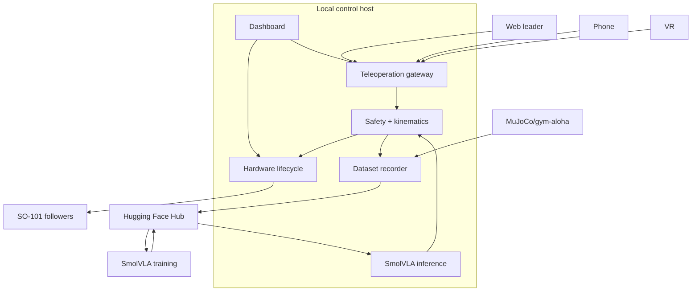

# B5 — Scope và Subsystems

> Trạng thái: draft chờ duyệt B4–B9.

## In scope

| Module | Scope bắt buộc | Kênh / dữ liệu |
| --- | --- | --- |
| Hardware lifecycle | Find Port, assign left/right, calibrate, check/preflight, Start/Stop/E-stop/Unlock | USB serial tại laptop control host |
| Teleoperation | 2 cặp leader–follower; web, phone và VR | leader pose/joint, phone pose, VR pose/button |
| Safety | clutch/deadman, timeout 1 s, hold pose, workspace/joint/rate validation, E-stop lock | safety state, action/observation |
| Dataset | khoảng 150 real episode, instruction, outcome, wrist + top-head camera; split 105/15/30 | LeRobotDataset / Hub |
| Simulation | MuJoCo/gym-aloha cho cùng task pick cube/bút vào hộp; tạo sim-data có provenance riêng; không cam kết sim-to-real transfer thành công | simulation episode/evaluation |
| SmolVLA | fine-tuning, checkpoint, benchmark/inference theo task hẹp | Hub, Kaggle/GPU thuê |
| Dashboard | readiness, teleop/safety status, camera/arm state, training progress, outcome | local-first dashboard |

## Out of scope

| Hạng mục | Lý do |
| --- | --- |
| ACT và Diffusion Policy | Chuyển FUTURE/OUT_OF_SCOPE qua ROC-01; chờ GVHD duyệt. |
| Login, RBAC, personal workspace | Local-first control host, không có yêu cầu remote multi-user; ROC-02 chờ GVHD duyệt. |
| Cloud/Internet robot control | Vượt safety/deployment scope; robot USB gắn control host. |
| Generalist manipulation hoặc task ngoài pick cube/bút vào hộp | Ngoài benchmark và giới hạn dữ liệu hiện tại. |
| Android precision ARCore teleop | Chưa có native 6DoF được xác nhận. |

## Subsystem diagram

## Scope constraints

- Control host là nơi duy nhất mở USB serial tới robot.
- Trusted LAN có thể dùng operator surface nhưng không biến hệ thống thành Internet/cloud control.
- Simulation và hardware dùng cùng định nghĩa task và tiêu chí PASS/FAIL.
- Số episode simulation chưa được chốt; không dùng số lượng này làm commitment/NFR.
