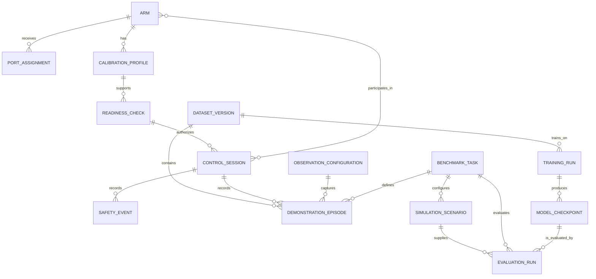

# B8 — Conceptual ERD

> Draft conceptual ERD: tên nghiệp vụ, quan hệ và bản số; không phải logical/physical database schema.

## Relationship decisions

- Arm ↔ ControlSession là M:N vì một session có một hoặc hai follower và có thể tham chiếu leader tương ứng; logical model sau này cần junction `SessionArm`.
- DemonstrationEpisode có nguồn real hoặc sim; provenance phải được giữ riêng.
- TrainingRun chỉ dùng một DatasetVersion được chốt; ModelCheckpoint thuộc TrainingRun.
- EvaluationRun phải nêu checkpoint, task, target mode và outcome để tránh kết quả mồ côi.

