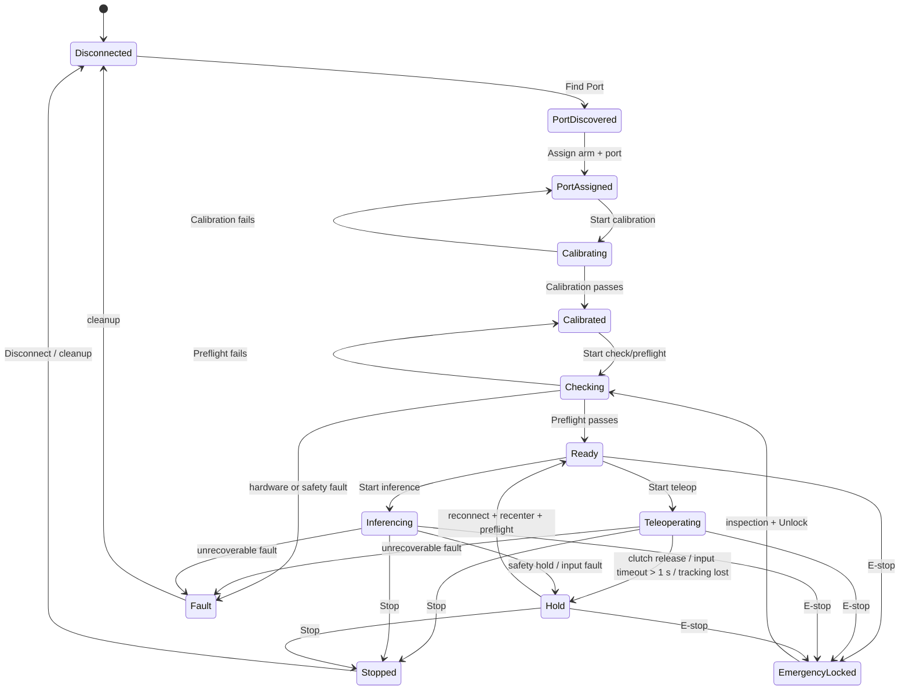

# B9 — State Models

> State model dưới đây ưu tiên workflow thực tế do nhóm xác nhận. Các state safety bổ sung từ canonical docs được ghi rõ.

## Arm lifecycle

## Transition rules

| From → To | Event | Guard / action | Rule |
| --- | --- | --- | --- |
| Disconnected → PortDiscovered | Find Port | Detect candidate port only; no motion. | BR-01, BR-02 |
| PortDiscovered → PortAssigned | Assign | Bind discovered port to intended arm side/role. | BR-01 |
| PortAssigned → Calibrating → Calibrated | Calibrate | Persist valid calibration profile. | BR-01 |
| Calibrated → Checking → Ready | Preflight | Port/calibration/arm set/safety prerequisites pass. | BR-03 |
| Ready → Teleoperating/Inferencing | Start | Session established and safety gate active. | BR-03, BR-10 |
| Active → Hold | Timeout/tracking loss/clutch release | No new motion; hold pose. | BR-05, BR-07 |
| Hold → Ready | Recovery | Reconnect, recenter and preflight again. | BR-07 |
| Any active/ready → EmergencyLocked | E-stop | Revoke motion and latch lock. | BR-08, BR-09 |
| EmergencyLocked → Checking | Unlock | Inspection then unlock; check again before Start. | BR-08 |
| Active/Hold → Stopped → Disconnected | Stop | Controlled stop, cleanup and disconnect. | BR-08 |

